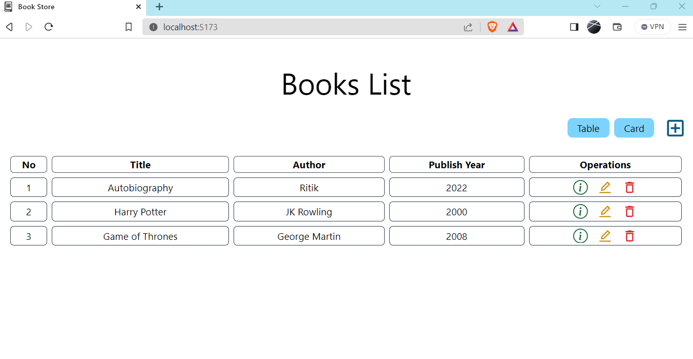
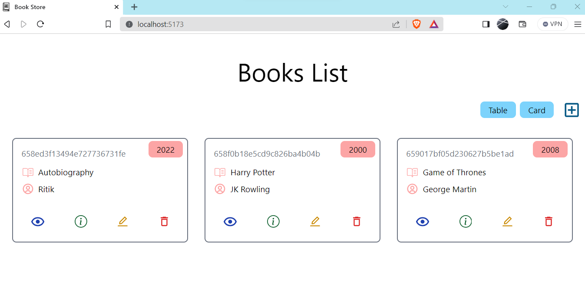
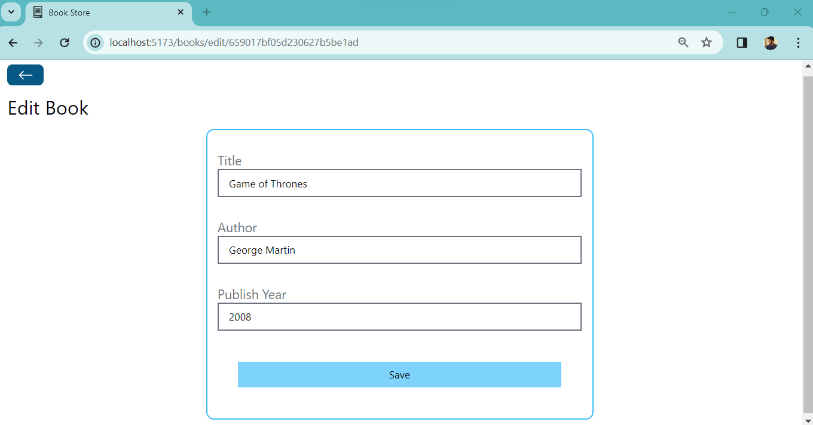
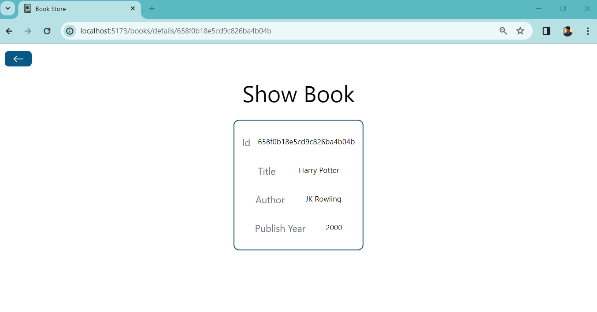

# 📚 MERN Book Store Project

### Website Preview

 
  <kbd>
    
  </kbd>

## Overview
Welcome to the MERN Book Store project! This dynamic web application seamlessly integrates MongoDB, Express.js, React.js, and Node.js to create a robust book store. It offers a secure user authentication system, real-time updates, and a smooth shopping experience, catering to diverse book enthusiasts. 
The MERN Book Store is a dynamic web application leveraging MongoDB, Express.js, React.js, and Node.js. It features secure user authentication, real-time updates, and a responsive design. Users can manage books, including adding, editing, and deleting entries, providing a seamless and intuitive book shopping experience. The technology stack includes React.js for the frontend, Node.js and Express.js for the backend, and MongoDB for the database. The project embraces a clean UI, tailoring to various devices, ensuring a dynamic and engaging platform for book enthusiasts. 

## 🚀 Features
- Developed a feature rich book store using the MERN stack (MongoDB, Express.js, React.js, Node.js).
- Implemented secure user authentication, real-time updates, and responsive design for an engaging user experience.
- Allowed book management operations, including addition, editing, and deletion, with a clean and intuitive UI.

 
  <kbd>
    
   
   
  </kbd>

## 🛠️ Technologies Used
- **Frontend:** React.js, React Router, Axios, Notistack, Tailwind CSS
- **Backend:** Node.js, Express.js, MongoDB, Mongoose
- **Other Tools:** Cors, Dotenv, Nodemon

## 🌐 API Endpoints
- **GET /books:** Retrieve all books
- **GET /books/:id:** Retrieve a specific book by ID
- **POST /books:** Add a new book
- **PUT /books/:id:** Update a book by ID
- **DELETE /books/:id:** Delete a book by ID

